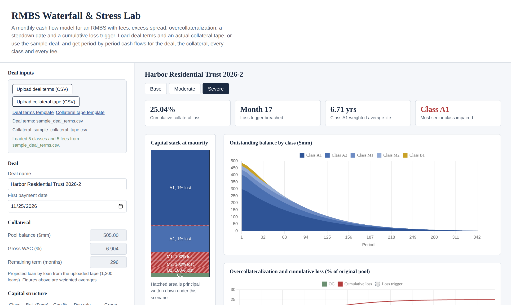
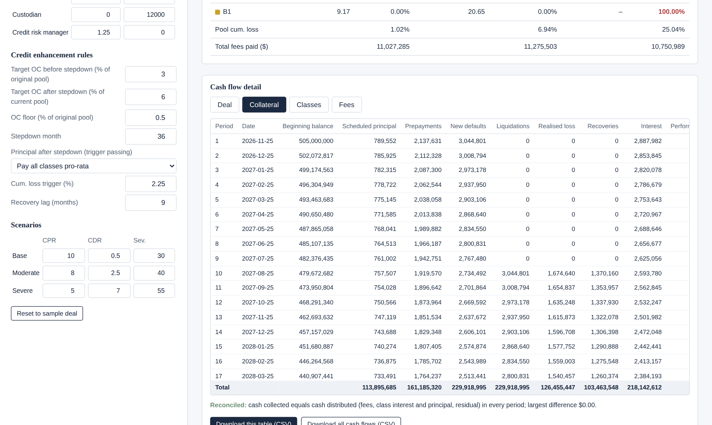

# RMBS Waterfall & Stress Lab

**[Open the live model](https://anandbhamri-dot.github.io/structured-finance-ai-lab/rmbs-waterfall-lab/)**

An interactive monthly cash flow model for an RMBS with fees, excess spread and overcollateralization, running entirely in the browser. Use the built-in sample deal, or upload your own deal terms and collateral tape.

## Inputs

**Deal terms (CSV)** with columns `type, name, amount, rate, pay_rule, pay_group`:

| type | name | amount | rate | pay_rule | pay_group |
|---|---|---|---|---|---|
| `deal` | `deal_name`, `first_payment_date`, `target_oc_pre_pct`, `target_oc_post_pct`, `oc_floor_pct`, `stepdown_month`, `post_stepdown_pay`, `cum_loss_trigger_pct`, `recovery_lag_months` (optional: `pool_balance_mm`, `wac_pct`, `remaining_term_months` when no tape is loaded) | value | | | |
| `tranche` | class name, e.g. `A1` | original balance ($) | coupon (%) | `sequential` or `pro_rata` | optional label |
| `fee` | fee name, e.g. `Servicing` | fixed amount ($ per year) | rate (bps per year on collateral balance) | | |

**Class payment rules**

- `sequential` classes are paid one after another, in the order listed.
- Consecutive `pro_rata` classes with the same `pay_group` (blank counts as the same group) are paid pari passu: they share principal, interest shortfalls and writedowns in proportion to their balances. Use different `pay_group` labels to keep two adjacent pro-rata sets separate, e.g. `Senior` for A1/A2 and `Mezz` for M1/M2.
- `post_stepdown_pay` sets what happens after the stepdown month while the loss trigger passes: `pro_rata_all` pays every class pro-rata; `class_rules` keeps each class's pay rule. A trigger breach always reverts to the class rules.
- Losses are written down from the most junior group upward.

Files without the `pay_rule` and `pay_group` columns still load, with every class treated as sequential. Fees are paid in the order listed, ahead of note interest.

**Collateral tape (CSV)** with columns `loan_id, current_balance, note_rate, remaining_term`. Each loan is projected individually with its own rate and term.

Templates download from the page, and working examples are in `sample_inputs/`.

## What it models

- **Collateral:** loan-level amortisation; prepayments (CPR → SMM), defaults (CDR → MDR) and severity. Defaulted loans stop paying interest and sit in a liquidation pipeline for the recovery lag; the loss is realised and recoveries paid at liquidation.
- **Waterfall:** fees, then class interest, then principal, following each class's sequential or pro-rata rule. After a passing stepdown, principal goes either pro-rata to all classes or by class rules; a trigger breach reverts to the class rules and locks the OC target.
- **Overcollateralization:** excess spread covers realised losses and turbos the notes to the OC target; the remainder goes to the residual.
- **Loss allocation:** writedowns from the most junior group upward, pro-rata within a pari passu group.

## Outputs

- Period-by-period cash flow tables for the **deal**, the **collateral**, **every class** (interest due / paid / shortfall, principal, writedown, balances) and **every fee**, with column totals
- A reconciliation check that cash collected equals cash distributed in every period
- Base, moderate and severe scenarios side by side: class WAL, principal loss, pool loss and total fees
- Capital stack, class run-off and OC vs cumulative loss charts
- CSV export of any table, or all cash flows at once

## Period-by-period cash flows

## Scope

A prototyping model, not a replacement for Intex. There is no servicer advancing, and fee and interest shortfalls are tracked but not carried forward.

---
Built by Anand Bhamri, with Claude as a modelling and prototyping partner. Single HTML file, no install.
